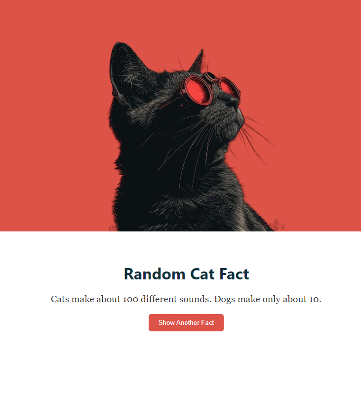

# Cat Facts App

This project is a simple React app that fetches random cat facts from the [Cat Fact API](https://catfact.ninja/). It follows best practices in code organization, error handling, separation of concerns, and demonstrates frontend developer skills. It also includes comprehensive testing to ensure the app behaves as expected.

---

## Live Demo

You can try the live version of the app here:

[Cat Facts App - Live Demo](https://cat-facts-omega.vercel.app/)

## Demo Screenshot



## Features

- Fetches a random cat fact from an API on page load.
- Displays the fetched cat fact in a clean, styled card.
- Provides a button to fetch another cat fact without reloading the page.
- Handles loading and error states, providing feedback to the user.
- Mobile-responsive design.
- Includes unit and integration tests for key app functionality.

---

## Best Practices Implemented

### 1. **Separation of Concerns**

- **Custom Hooks**: The data-fetching logic is separated into a custom hook (`useCatFact`) to keep component logic clean and reusable.
- **Component Splitting**: UI components (`CatFactDisplay` and `CatFactButton`) are broken down into smaller, reusable units, making the app scalable and easier to manage.
- **Service Layer**: API calls are managed in a separate service (`catFactService.ts`), isolating external logic from the UI.

### 2. **Error Handling**

- The app implements robust error handling for API failures. If the API request fails, a user-friendly error message is displayed, instead of crashing the app.

### 3. **Loading State**

- A loading state is shown to the user while fetching data, improving the user experience by indicating that data is being fetched.

### 4. **CSS BEM Naming Convention**

- The CSS classes follow the Block-Element-Modifier (BEM) naming convention, making the styles more maintainable and modular.

### 5. **Accessibility**

- The image has a descriptive `alt` tag, improving accessibility for screen readers.

### 6. **Resilient UI**

- The "Show Another Fact" button is disabled during the loading state to prevent multiple fetch requests from being triggered simultaneously.

---

## Skills Demonstrated

### 1. **React & TypeScript**

- Usage of React with TypeScript to enforce type safety.
- Application of hooks (`useState`, `useEffect`) and custom hooks to manage side effects and state.

### 2. **Component-Based Architecture**

- Understanding of breaking down UI into modular, reusable components for scalability and reusability.

### 3. **Asynchronous JavaScript (Promises & `async/await`)**

- Proper handling of asynchronous API requests with `fetch` and `async/await`.

### 4. **Error and Loading States**

- Managing loading and error states to improve the user experience.

### 5. **CSS Styling & BEM**

- Clean, responsive styling with CSS following the BEM naming convention for clarity and scalability.

### 6. **API Integration**

- Fetching data from a third-party API and integrating it into a user-friendly interface.

### 7. **Separation of Logic**

- Service layer abstraction for API calls and separating UI from business logic using custom hooks.

---

## Testing

The app includes comprehensive testing to ensure reliability and robustness. It uses Jest and React Testing Library for unit and integration testing.

### Key Test Cases:

- **Component Rendering**: Ensures components like `CatFactButton` and `CatFactDisplay` render correctly.
- **API Calls**: Mocks API requests to the Cat Fact API and tests successful and unsuccessful fetch operations.
- **Button Interactions**: Tests the button's functionality, including its disabled state during loading and its ability to fetch new facts.
- **Loading and Error States**: Ensures that the app displays the appropriate UI when fetching data or encountering errors.

### Example Test Commands:

1. To run all tests:
   ```bash
   npm run test
